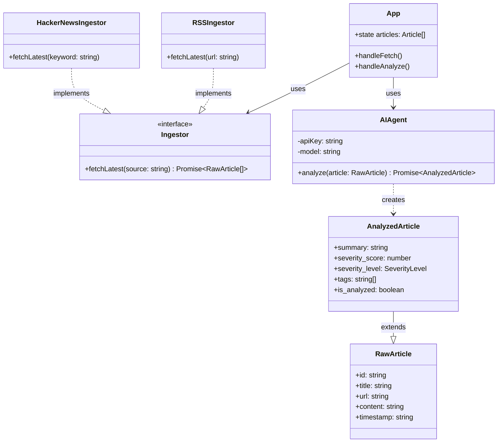

# Architecture & Design

## Design Philosophy
The application follows strictly typed functional programming patterns within a React context, while adopting Object-Oriented patterns (Strategy) for the service layer to ensure extensibility.

## Class Diagram
The following diagram illustrates the relationships between the UI, the Service Layer (Strategy Pattern), and the Data Models.

## Key Components

### 1. Ingestion Layer (`services/ingestors/`)
*   **Pattern**: Strategy Pattern.
*   **Purpose**: Allows adding new data sources (e.g., Twitter, CVE databases) without modifying the main application logic.
*   **Interface**: `Ingestor` defines the contract `fetchLatest(source: string)`.

### 2. Processing Layer (`services/processor/`)
*   **Component**: `AIAgent`.
*   **Purpose**: Encapsulates the complexity of the LLM interaction. It handles prompt engineering, JSON schema validation, and error handling for the Google Gemini API.

### 3. Data Model (`models/schema.ts`)
*   **Pattern**: DTO (Data Transfer Object).
*   **Purpose**: Ensures type safety across the application. Input data is normalized immediately upon entry into `RawArticle`, and strictly typed output is enforced via `AnalyzedArticle`.
