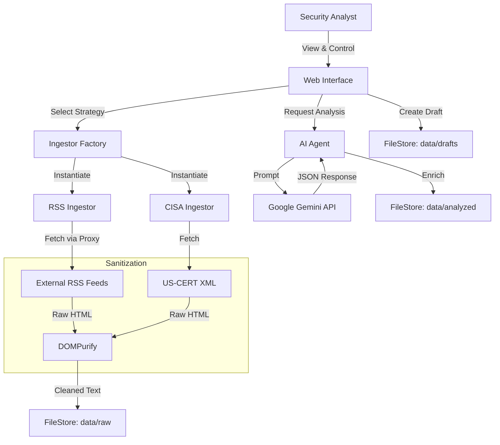

# SecurityFeed AI

## Overview
SecurityFeed AI is an intelligent security news aggregator designed to ingest, analyze, and prioritize cyber threat intelligence. 

By leveraging the **Strategy Pattern** for data ingestion and **Google Gemini 1.5/3** for semantic analysis, the system transforms raw news feeds into structured, actionable intelligence with severity scoring and IOC (Indicator of Compromise) extraction.

## Key Features
*   **Multi-Source Ingestion**:
    *   **RSS Generic**: Real-time fetching via `rss2json` bridge.
    *   **CISA Alerts**: Dedicated strategy for US-CERT alerts.
    *   **HackerNews**: API integration for keyword monitoring.
*   **Zero-Trust Security**: Input sanitization using **DOMPurify** to prevent XSS from untrusted feeds.
*   **AI-Powered Analysis**: Uses Google Gemini to summarize threats, assign severity scores (1-10), and extract relevant tags.
*   **FileStore Architecture**: Flat-file storage simulation replacing Redis for simplified data persistence (`data/raw`, `data/analyzed`, `data/drafts`).

## System Map

## Quick Start
1.  Select an Ingestion Strategy (RSS, CISA, or HackerNews).
2.  Input a source URL or use the CISA default.
3.  Click **Fetch** to retrieve and sanitize raw articles (saved to `data/raw`).
4.  Click **Analyze** to process articles through the LLM (saved to `data/analyzed`).
5.  Click **Save Draft** to generate Markdown for Velog (saved to `data/drafts`).
