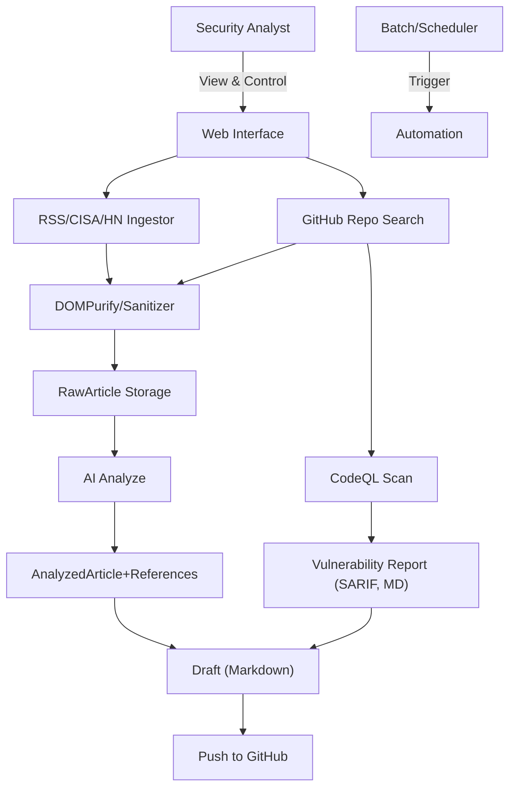
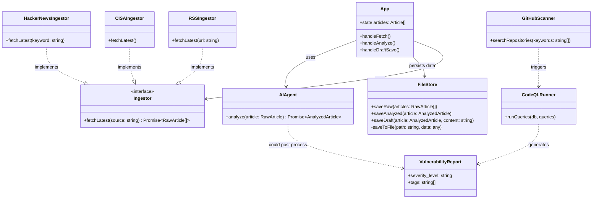

# Architecture & Design

---

## System Architecture (2026-01 최신화)

### Explanation
- **Ingestion Layer:** RSS, CISA, HackerNews 뉴스 + GitHub 오픈소스 저장소 동적 검색
- **Processing Layer:** AI 기반 기사 분석, CodeQL로 저장소 정적 분석
- **Storage Layer:** FileStore(Flat-json/Markdown)
- **GitOps:** 취약점/인텔리전스 보고서 자동 배포
- **전체 흐름:** 최신 위협 뉴스 + 오픈소스 취약점(자동) → AI/CodeQL → Draft → Git 자동 커밋

---

## Key Modules

### Ingestion Layer (`services/ingestors/`)
- **Pattern**: Strategy
- **Components**: `RSSIngestor`, `CISAIngestor`, `HackerNewsIngestor`, `GitHubScanner`
- **Security**: DOMPurify, XSS 차단

### Storage Layer (`services/storage/`)
- **Pattern**: FileStore Repository
- **Data Flows:**
  - `data/raw/` → 원본
  - `data/analyzed/` → AI 분석
  - `data/drafts/` → 블로그/게시 가능 Markdown
  - `data/vulnerabilities/` → CodeQL 결과

### Processing Layer (`services/processor/`)
- **AIAgent**: 기사/취약점 분석 (Gemini)
- **CodeQL**: 자동 코드/저장소 정적분석
- **VulnerabilityAnalyzer**: SARIF → 요약/태그/참조 생성

### Publishing + Automation
- Headless Node.js / crontab / 자동 배포

---

## Class Diagram (핵심 관계 예시)

---
