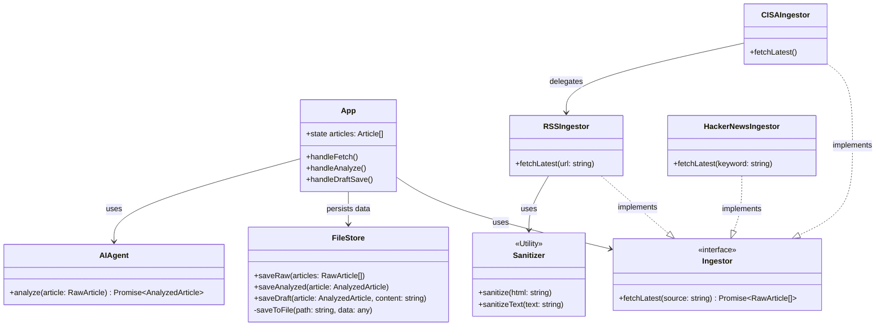

# Architecture & Design

## Design Philosophy
The application follows strictly typed functional programming patterns within a React context, while adopting Object-Oriented patterns (Strategy) for the service layer to ensure extensibility. Data persistence is handled via a **FileStore** abstraction.

## Class Diagram
The following diagram illustrates the relationships between the UI, the Service Layer (Strategy Pattern), and the Data Models.

## Key Components

### 1. Ingestion Layer (`services/ingestors/`)
*   **Pattern**: Strategy Pattern.
*   **Components**: `RSSIngestor`, `CISAIngestor`, `HackerNewsIngestor`.
*   **Security**: All external input is passed through `DOMPurify` (via `Sanitizer`) before entering the application state.

### 2. Storage Layer (`services/storage/`)
*   **Pattern**: Repository / FileStore.
*   **Purpose**: Simulates a file-based workflow typical in data pipelines.
    *   `data/raw/`: Initial sanitized JSON dump.
    *   `data/analyzed/`: AI-enriched structured data.
    *   `data/drafts/`: Final publication-ready Markdown files.

### 3. Processing Layer (`services/processor/`)
*   **Component**: `AIAgent`.
*   **Purpose**: Encapsulates the complexity of the LLM interaction (Gemini).

### 4. Data Model (`models/schema.ts`)
*   **Pattern**: DTO (Data Transfer Object).
*   **Purpose**: Ensures type safety.
