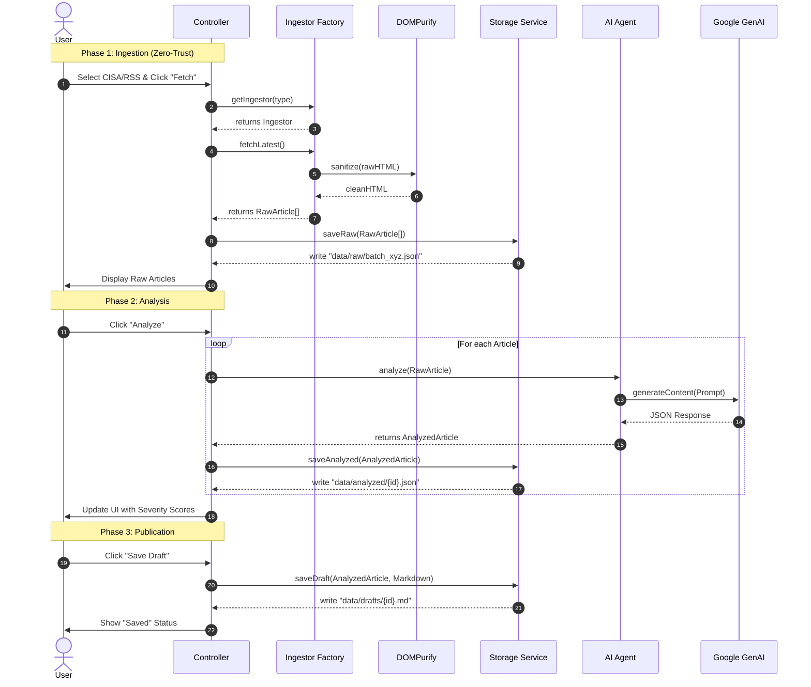

# Data Flow Documentation

## Overview
This document describes the lifecycle of a security article from external ingestion to AI enrichment and FileStore persistence.

## Processing Sequence

## Storage Hierarchy
*   **Level 1 (Raw)**: `data/raw/` - Immutable source of truth (post-sanitization).
*   **Level 2 (Structured)**: `data/analyzed/` - Intelligence added (scores, tags).
*   **Level 3 (Product)**: `data/drafts/` - Human-readable outputs (Markdown).
