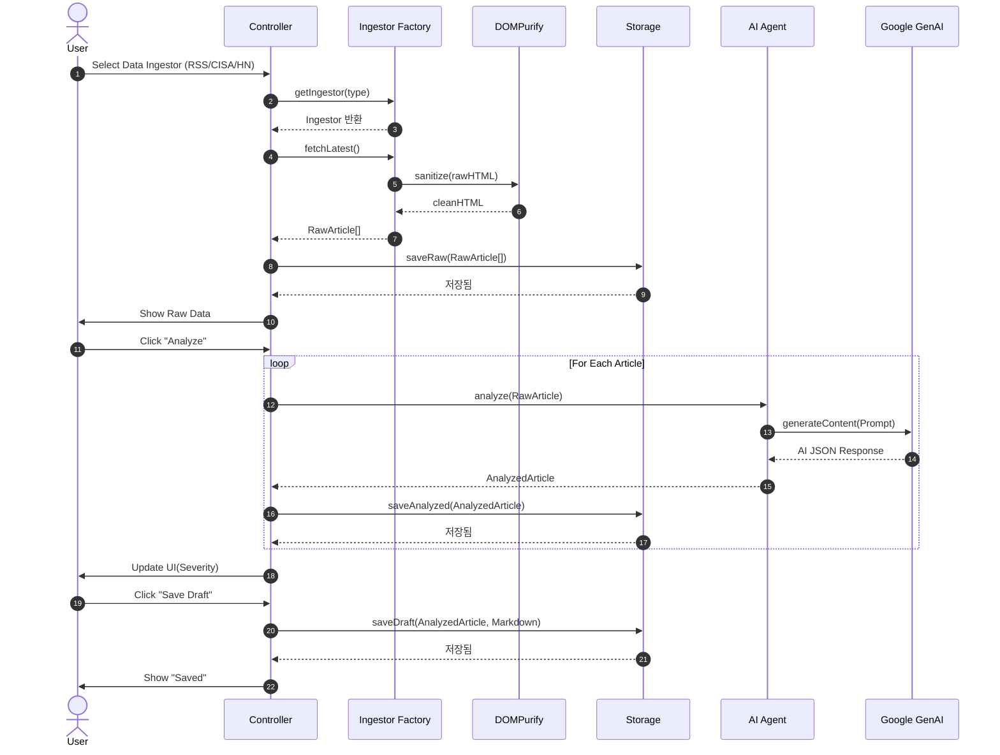
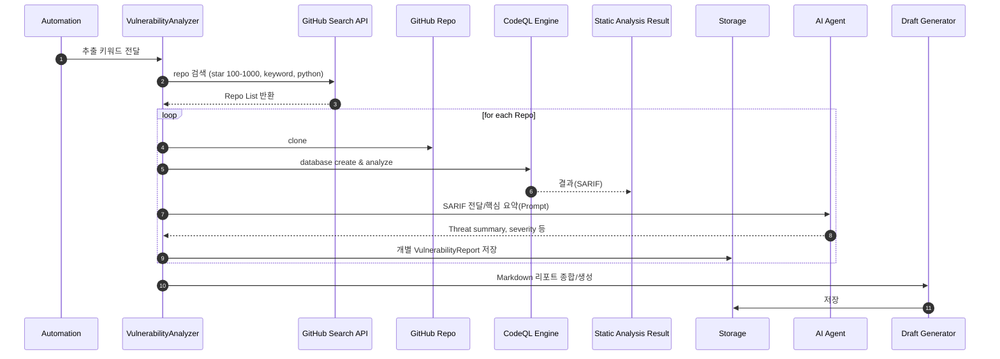

# Data Flow Documentation

## Overview
이 문서는 SecurityFeed의 주요 워크플로(뉴스/저장소 → AI/CodeQL 분석 → Reporting) 전체를 단계별로 설명합니다.

---

## Processing Sequence

### A. 일반 인텔리전스 분석 (뉴스 기반)

### B. Github + CodeQL 취약점 워크플로

---

## Storage Hierarchy
- **Level 1 (Raw)**: `data/raw/`           : 원본/뉴스 수집 결과
- **Level 2 (Analyzed)**: `data/analyzed/` : AI 분석, Tag/Severity, reference 부여
- **Level 3 (Drafts)**: `data/drafts/`     : Markdown, Blog-ready
- **Level 4 (Vuln)**: `data/vulnerabilities/` : CodeQL 결과 + AI 요약
