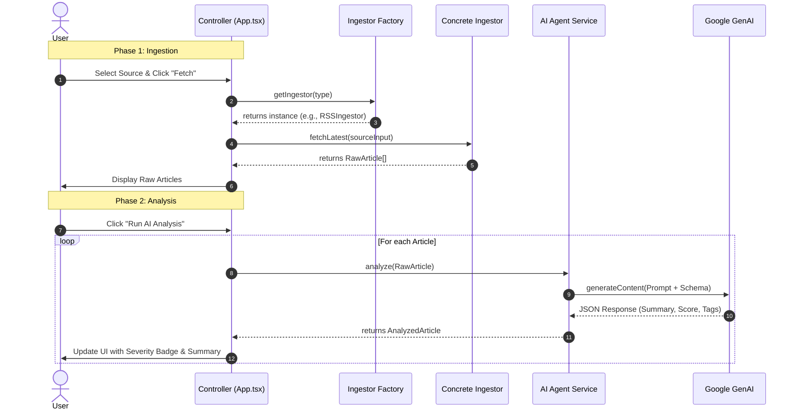

# Data Flow Documentation

## Overview
This document describes the lifecycle of a security article from external ingestion to AI enrichment and visualization.

## Processing Sequence

## State Transitions
1.  **Empty State**: No data loaded.
2.  **Raw State**: Data fetched, contains `title`, `content`, `url`. `is_analyzed = false`.
3.  **Analyzed State**: Data enriched with `severity_score`, `tags`. `is_analyzed = true`.
